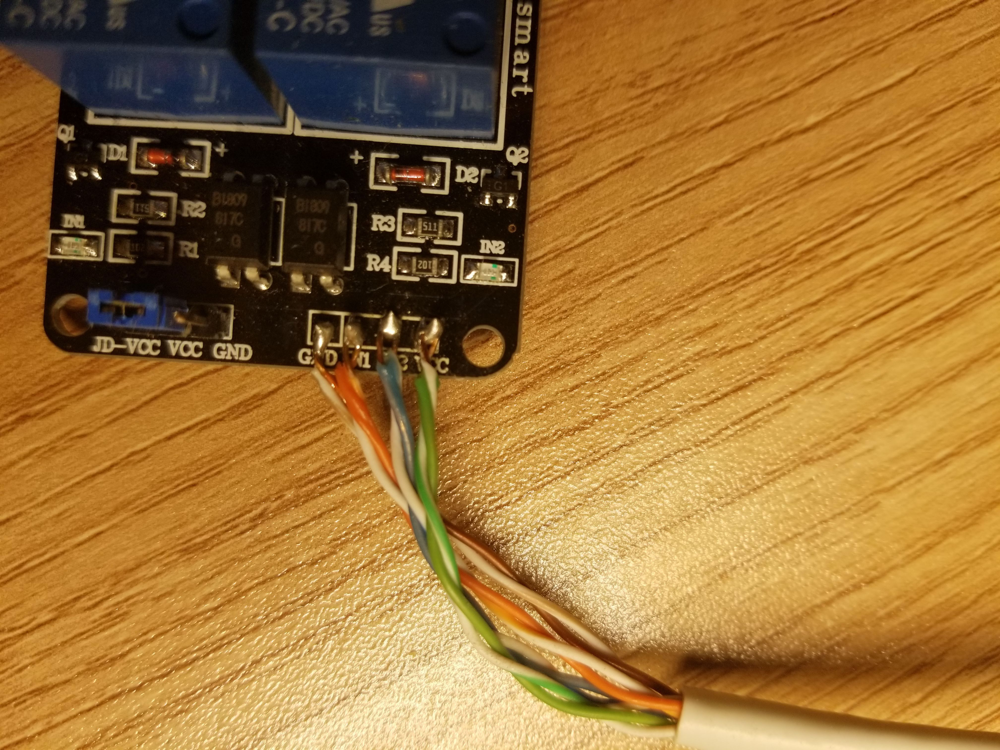
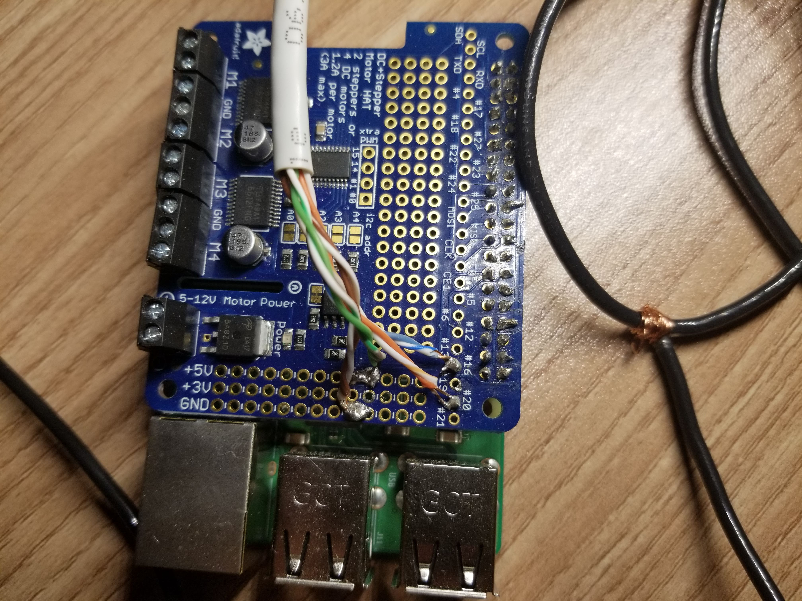

# Raspberry PI Smart Gate

## Description
Smart driveway gate controlled by a raspberry pi.

## Disclaimer

As the source code creator, I'm not labile for damages done to personal property or persons. USE AT YOUR OWN RISK

## Architecture

### Server

The server code architecture is a RESTful api, allowing for a span of devices to control the gate. Server code is written in python (3.5.3) with the <a href= "http://flask.pocoo.org/docs/1.0/quickstart/"> flask library </a> (1.0.2). The RPi.GPIO library is also used to control the linear actuator from the raspberry pi.

#### Identify gate position

Identifying the position at startup is accomplished by running pin# for 30 seconds which moves the gate to a known position (fully open). An integer is also initialized and set to 0 used for tracking.

```python
self.running = False # prevents multiple actions at same time
self.status = 0 # integer represents gate location (0 = fully open, 10 fully closed)
self.EmeStop = False # stops gate if true

# Initialize the gate to be fully open
GPIO.setup(pin2,GPIO.OUT)
GPIO.output(pin2,False)
time.sleep(30) # leave pin on for 30 seconds
GPIO.output(pin2,True)

```

#### Tracking gate position

After identifying the gates position, tracking can begin. Using a range of integers (0-10) to represent locations, each integer also represents a single second in time. An integer based system allows for simple logic to take place with different situations. For example, the gate is fully open "position 0" and moving to be closed "position 10", during the closing the user stops the gate at position 6 then reopens the gate; Looping from 6 down to 0, equivalent to running for 5 seconds, will bring the gate back to fully open. The gateController function within the gate class handles this operation.


```python
def gateController(self,PinNumber):
    GPIO.setup(PinNumber,GPIO.OUT) # set up pin
    if PinNumber == 20 and self.status != 0: # Check pin number and not already closed
        self.running = True # set the gate to running
        for a in range(self.status,-1, -1): # loop down to 0 (fully open)
            self.status = a # keep track of location
            if self.EmeStop == True: # check to stop the gate
                GPIO.output(PinNumber,True)
                self.running = False # gate not running when stopped
                break
            else:
                time.sleep(1) # each integer can also represents a second of time
                GPIO.output(PinNumber,False)
        GPIO.output(PinNumber,True)
        self.running = False
    # pin 16 is very similar to the pin 20
    elif PinNumber == 16  and self.status != 10:
        self.running = True
        for b in range(self.status, gateClosing+1): # loop up to 10 (fully closed)
            self.status = b
            if self.EmeStop == True:
                GPIO.output(PinNumber,True)
                self.running = False
                break
            else:
                time.sleep(1)
                GPIO.output(PinNumber,False)
        GPIO.output(PinNumber,True)
        self.running = False
```


### IOS App

I created a IOS app that demonstrates how to open, close and stop the gate through post requests. The app isnt ready for github yet. But plans are to distribute it on the app store for free and maybe build a android app as well.


## Endpoints

A single endpoint exist "/gate" that allows for Post and Get requests. A post request takes in application/JSON with one object a gate command. Three gate commands exist "open","close" and "stop". Security will need to be upgraded to either Oauth2.0 or token-based.

Example Post request
```JSON
{
	"gate":"open",
}
```
Get request to the endpoint will respond with the gates position (integer from 0-10).


## Setup/Install

### Parts
1. Raspberry Pi (<a href="https://www.adafruit.com/product/3775" >Raspberry Pi 3 - Model B+</a> $35.00)

2. 12 volt Linear Actuator (<a href= "https://www.amazon.com/ECO-WORTHY-Actuator-Maximum-Mounting-Brackets/dp/B07H9VZ66R" > Linear Actuator </a> $66.99)

3. Two Channel relay (<a href="https://www.amazon.com/dp/B0057OC6D8">SainSmart 2-Channel Relay Module </a> $8.99)

Not need, but helps with soldering
4. Adafruit DC & Stepper Motor HAT for Raspberry Pi - Mini Kit (<a href="https://www.adafruit.com/product/2348">Stepper Motor HAT for Raspberry Pi </a> $22.50)

### Wiring Digram

There are many tutorials on how to hook up a raspberry pi to a relay. Below are some links I used and pictures.

<i> Note: Im using pins 20 and 16 on the raspberry pi, if these are changed they will need to be changed in server code lines 7-8. </i>

<a href = "https://tutorials-raspberrypi.com/raspberry-pi-control-relay-switch-via-gpio/">https://tutorials-raspberrypi.com/raspberry-pi-control-relay-switch-via-gpio/</a>

<a href = "https://www.raspberrypi.org/forums/viewtopic.php?t=36225">https://www.raspberrypi.org/forums/viewtopic.php?t=36225</a>







### Raspberry PI

A microSD card with at least 8GB of storage is needed to install a OS on your raspberryPI.

I recommend <a href="https://www.raspberrypi.org/downloads/raspbian/">Raspbian Stretch Lite</a> OS installed using this <a href = "https://www.raspberrypi.org/documentation/installation/installing-images/">tutorial</a>.

Note: Raspbian Stretch Lite as no UI, so having a understanding of CLI or ssh is necessary.


### Configuration

By default python3 should be install on Raspbian Stretch Lite.

Test by running

    python3 --version

<b>Python3 imports</b>

The only pip library needed is flask, the RPi.GPIO library is installed by default.

    pip install flask

or

    pip3 install flask

<b> IP address settings</b>

To connect your PI to your wireless network use <a href ="https://www.raspberrypi.org/documentation/configuration/wireless/wireless-cli.md">this tutorial</a>.

A static ip address must be assigned from the router or pi.  I recommend from the router to prevent a duplicate address.

<i>Note this allows for commands to be set only from your local network.</i>

### Running the server
1. Login into the raspberryPI and clone the repository.

 Clone the repository with git.

        git clone https://github.com/MitchTODO/Smart-driveway-gate.git

2. cd into the repository.

        cd Smart-driveway-gate

3. Port and Ip address.

  For more info on finding your private IP address go <a href = "https://learn.adafruit.com/adafruits-raspberry-pi-lesson-3-network-setup/finding-your-pis-ip-address">here</a>. Info on ports go <a href = "https://study-ccna.com/ports-explained/"> here</a>.

  Sudo nano into gateServer.py, change to your ip address and port settings (last line in file).

        sudo nano gateServer.py

4. Run gateServer.py

        python3 gateServer.py

You should see flask start up and running.

I recommend testing the api from a tool called <a href = "https://www.getpostman.com/">postman</a>.

<b>Auto running at Startup</b>

<a href ="https://www.dexterindustries.com/howto/run-a-program-on-your-raspberry-pi-at-startup/">Five Ways To Run a Program On Your Raspberry Pi At Startup</a>

It seems the best way to run python from rc.local is by running a compiled script from rc.local. Then within the script run your python.

1. Create a cpp file.

```cpp
#include <cstdlib>

int main(){
system("python3 /home/pi/Smart-driveway-gate/gateServer.py");
return 0;
}
```

2. Compile using gcc.

        gcc gateServer.py

3. Edit /etc/rc.local and add the following line before "exit 0".

        su pi -c '/home/pi/a.out' &


### Connecting to the Gate from the anywhere with HTTPS

<i>Note: Opening any ports on a route can be potentially dangerous.</i>

This is done by port forwarding from your router to your pi.

I recommended buying a domain name over a public IP allowing HTTPS.

For those who have static public ip address, create an "A" record from your DNS provider.

Otherwise, use dynamic DNS.


Free ssl certificates provided by open source CA called <a href = "https://letsencrypt.org/">LetsEncrypt</a>. This allow for secure channel when connecting to the pi API.

## Issues

Two issues optimization and lack of security.

## Contribute

Please feel free to add and revise.

## Donate 

Bitcoin : 3JNt1WTCUjzNv1TRH8izBXeykc3fJickvH

Bitcoin Cash : qrdrhvt22c704j7spefwmfukldls0xh4dgzuddygdk

Ethereum : 0xb47FBDa22a4ABb33DB715Dc9DBcD05f4f3246012

Ethereum Classic : 0xc0fe1fD4bD931570991B59334473A34BA369A360

Litecoin : LLLyGUKrgp862jyTCF8DDs7m9hoqhXdESr

0x : 0x96a495494FFDf16692697BcfE23815A02a17171d

Basic Attention Token : 0xE823D80C8B8914D2b1e8c4B9C08A6A941C5256Ab

Zcash : t1NnhqBy1dCRvJG8LyCDxXPk2h5Hju7YTSf


## Licensing

GNU General Public License v2.0
